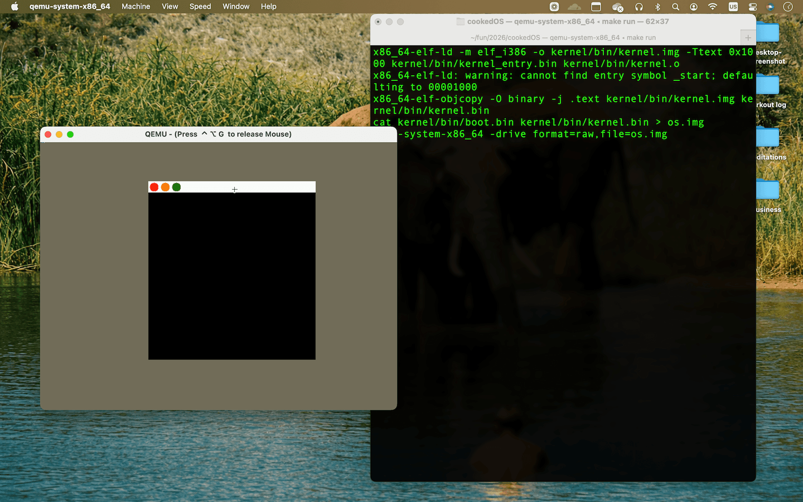

## Build

```bash
make
```

## Run

```bash
make run
```

## Run over VNC

```bash
make run-vnc
```

## macOS toolchain

On macOS, install dependencies with Homebrew:

```bash
brew install nasm qemu x86_64-elf-gcc
brew install --cask tigervnc
```

The `makefile` uses the `x86_64-elf-*` cross-toolchain by default on macOS.

If the native QEMU window does not handle trackpad mouse input correctly on macOS, use TigerVNC instead:

1. Run `make run-vnc`
2. Open `TigerVNC.app`
3. Connect to `127.0.0.1:5900`

## Screenshot


