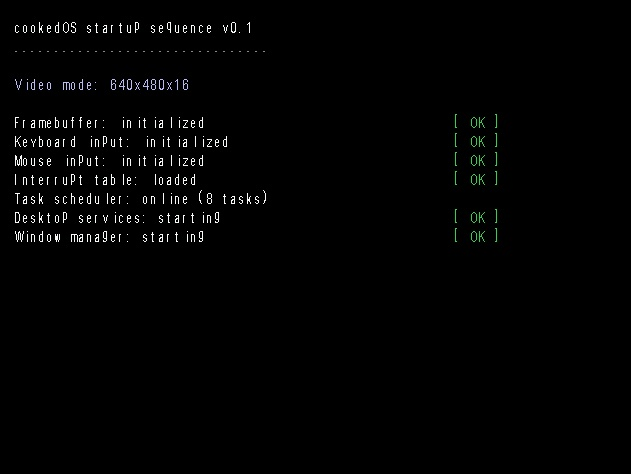
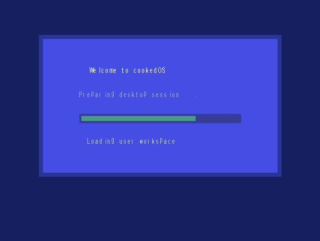
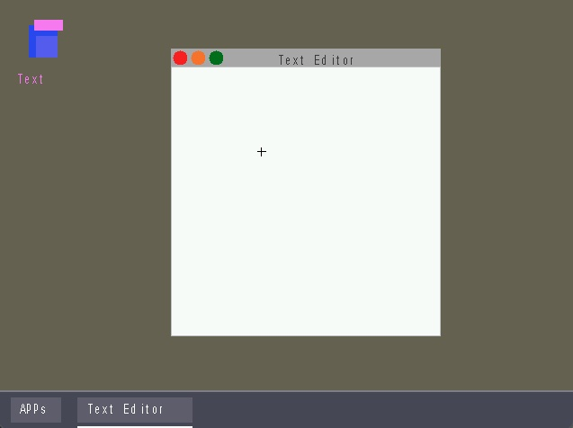

## cookedOS

Simple, very tiny OS. I had too much fun coding an OS in early 2025 for an OS class at De La Salle University, but at the time I never got to do much "userspace" coding. Here,  everything is running on ring-0 so I can toy with and prototype useable apps fast that the user can interact with, thereby mimicking a "userspace" despite architecturally there being no process isolation.

## Goal

THe road to doom

- my 50 sector bootloader needs to be upgraded 
- add .WAD loader
- memory allocation and time support
- connect doom graphics to the framebuffer
- map the mouise and keyboard input
- launch Doom as another ring0 app

Optional goal is progbably having sound

## Build

```bash
make
```

## Run

```bash
make run
```

## Run over VNC

```bash
make run-vnc
```

## macOS toolchain

On macOS, install dependencies with Homebrew:

```bash
brew install nasm qemu x86_64-elf-gcc
brew install --cask tigervnc
```

The `makefile` uses the `x86_64-elf-*` cross-toolchain by default on macOS.

If the native QEMU window does not handle trackpad mouse input correctly on macOS, use TigerVNC instead:

1. Run `make run-vnc`
2. Open `TigerVNC.app`
3. Connect to `127.0.0.1:5900`

## Screenshotss






